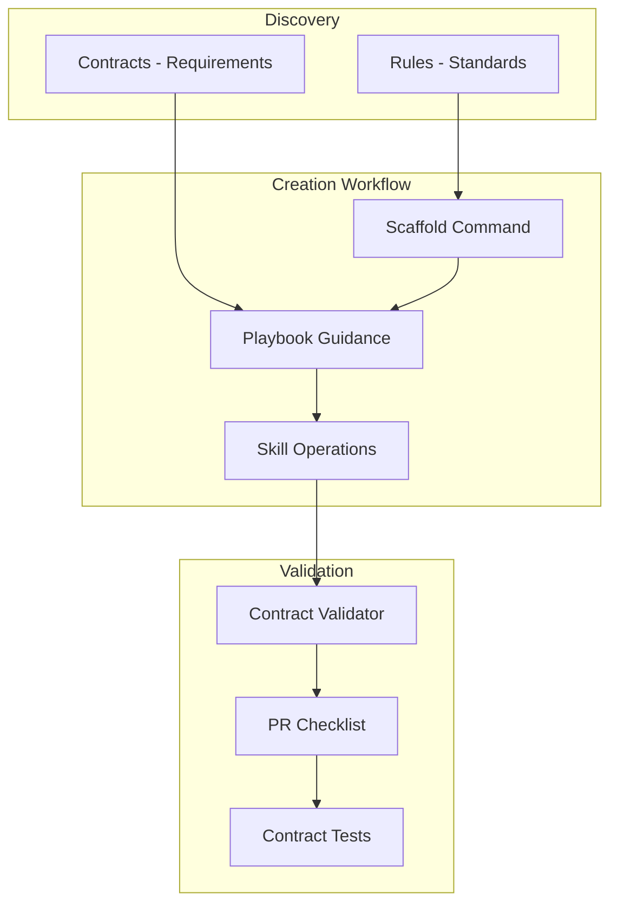

# 3Lens Cursor Configuration

This directory contains Cursor AI agent configurations for the 3Lens project, including agents, commands, rules, and skills.

## Overview

The `.cursor` folder provides structured guidance for AI agents working on 3Lens, ensuring consistency, contract compliance, and efficient development workflows.

## Structure

```
.cursor/
├── agents/          # Specialized subagents for specific tasks
├── commands/        # CLI command documentation
├── rules/           # File-pattern-specific rules and standards
└── skills/          # Detailed skill documentation
```

## Workflow



## Quick Start

### For New Contributors

1. Read [agents.md](../agents.md) for project overview
2. Check [.cursor/agents/onboarding-guide.md](agents/onboarding-guide.md) for navigation help
3. Review [agents/contracts/](../agents/contracts/) for requirements

### For Adding Features

1. Use scaffold commands: `3lens scaffold [component]`
2. Follow playbooks: `agents/playbooks/add-a-[component].md`
3. Reference skills: `.cursor/skills/[operation]/SKILL.md`
4. Validate: `3lens validate contracts`

### For Code Review

1. Use code-reviewer agent for architectural checks
2. Validate contracts: `3lens validate contracts`
3. Check PR checklist: `agents/checklists/pr.md`

## Agents

Specialized subagents for specific tasks:

- **contract-validator** - Validates code against contracts
- **playbook-executor** - Guides through structured playbooks
- **trace-analyzer** - Deep trace analysis
- **code-reviewer** - PR review with architectural awareness
- **migration-assistant** - Version upgrade guidance
- **performance-optimizer** - Performance analysis and optimization
- **test-generator** - Generate contract and regression tests
- **onboarding-guide** - Help new contributors navigate

See [agents/README.md](agents/README.md) for details.

## Commands

CLI command documentation:

- **trace** - Record, open, and compare traces
- **query** - Performance analysis queries
- **inspect** - Entity inspection
- **scaffold** - Generate boilerplate code
- **validate** - Contract validation
- **test** - Run contract tests
- **doctor** - Diagnostics

See [commands/README.md](commands/README.md) for complete list.

## Rules

File-pattern-specific rules and standards:

- **project-standards** - Core design principles (always applied)
- **contract-compliance** - Kernel/runtime contract rules
- **test-standards** - Test file patterns
- **docs-standards** - Documentation structure
- **addon-standards** - Addon requirements
- **ui-standards** - UI component patterns
- **host-standards** - Host implementation requirements
- **mount-standards** - Framework mount patterns
- **example-standards** - Example structure
- **commit-standards** - Commit message format

See [rules/README.md](rules/README.md) for details.

## Skills

Detailed skill documentation for specialized operations:

- **diff-operations** - Compare traces and frames
- **doctor-operations** - Diagnose issues
- **inspector-operations** - Navigate entities
- **query-operations** - Analytical queries
- **scaffold-operations** - Generate boilerplate
- **shader-operations** - Shader introspection
- **trace-operations** - Capture and replay
- **validation-operations** - Validate contracts
- **mount-operations** - Framework mounts
- **ui-operations** - UI development
- **host-operations** - Host development
- **testing-operations** - Test workflows
- **example-operations** - Example creation
- **cli-operations** - Advanced CLI usage

See [skills/README.md](skills/README.md) for complete list.

## Related Resources

- Project Guide: [agents.md](../agents.md)
- Contracts: [agents/contracts/](../agents/contracts/)
- Playbooks: [agents/playbooks/](../agents/playbooks/)
- Checklists: [agents/checklists/](../agents/checklists/)