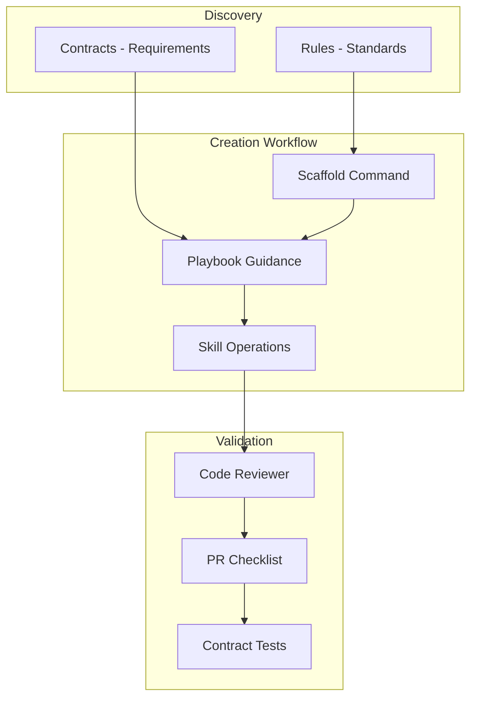

# 3Lens Cursor Configuration

This directory contains Cursor AI agent configurations for the 3Lens project, including agents, commands, rules, and skills.

## Overview

The `.cursor` folder provides structured guidance for AI agents working on 3Lens, ensuring consistency, contract compliance, and efficient development workflows.

## Structure

```
.cursor/
├── agents/          # Specialized subagents for specific tasks
├── commands/        # CLI command documentation
├── contracts/       # Architectural contracts (source of truth)
├── playbooks/       # Step-by-step development workflows
├── rules/           # File-pattern-specific rules and standards
└── skills/          # Detailed skill documentation
```

## Workflow


```mermaid
flowchart TD
    subgraph discovery [Discovery]
        rules[Rules - Standards]
        contracts[Contracts - Requirements]
    end
    
    subgraph creation [Creation Workflow]
        scaffold[Scaffold Command]
        playbook[Playbook Guidance]
        skill[Skill Operations]
    end
    
    subgraph validation [Validation]
        reviewer[Code Reviewer]
        checklist[PR Checklist]
        tests[Contract Tests]
    end
    
    rules --> scaffold
    contracts --> playbook
    scaffold --> playbook
    playbook --> skill
    skill --> reviewer
    reviewer --> checklist
    checklist --> tests
```

## Quick Start

### For New Contributors

1. Read [AGENTS.md](../AGENTS.md) for project overview
2. Check [.cursor/agents/onboarding-guide.md](agents/onboarding-guide.md) for navigation help
3. Review [.cursor/contracts/](contracts/) for requirements

### For Adding Features

1. Use scaffold commands: `3lens scaffold [component]`
2. Follow playbooks: `.cursor/playbooks/add-a-[component].md`
3. Reference skills: `.cursor/skills/[operation]/SKILL.md`
4. Validate: `3lens validate all`

### For Code Review

1. Use code-reviewer agent for architectural checks
2. Validate contracts: `3lens validate all`

## Agents

Specialized subagents for specific tasks:

- **bug-fixer** - Autonomous end-to-end bug fixing
- **code-reviewer** - PR review (normal or harsh mode)
- **trace-analyzer** - Deep trace analysis
- **performance-optimizer** - Performance analysis and optimization
- **migration-assistant** - Version upgrade guidance
- **test-generator** - Generate contract and regression tests
- **onboarding-guide** - Help new contributors navigate and learn

See [agents/README.md](agents/README.md) for the full routing table.

## Commands

CLI command documentation (only documented commands exist in CLI):

- **trace** - Record, open, and compare traces
- **query** - Performance analysis queries
- **scaffold** - Generate boilerplate (panel, probe, host, addon)
- **validate** - Contract validation
- **doctor** - Diagnostics

See [commands/README.md](commands/README.md) for complete list.

## Rules

File-pattern-specific rules and standards:

- **project-standards** - Core design principles (always applied)
- **contract-compliance** - Kernel/runtime contract rules
- **test-standards** - Test file patterns
- **docs-standards** - Documentation structure
- **addon-standards** - Addon requirements
- **ui-standards** - UI component patterns
- **host-standards** - Host implementation requirements
- **mount-standards** - Framework mount patterns
- **example-standards** - Example structure
- **commit-standards** - Commit message format

See [rules/README.md](rules/README.md) for details.

## Skills

Detailed skill documentation for specialized operations:

- **diff-operations** - Compare traces and frames
- **doctor-operations** - Diagnose issues
- **inspector-operations** - Navigate entities
- **query-operations** - Analytical queries
- **scaffold-operations** - Generate boilerplate
- **shader-operations** - Shader introspection
- **trace-operations** - Capture and replay
- **validation-operations** - Validate contracts
- **mount-operations** - Framework mounts
- **ui-operations** - UI development
- **host-operations** - Host development
- **testing-operations** - Test workflows
- **example-operations** - Example creation

See [skills/README.md](skills/README.md) for complete list.

## Parallel Sessions with Git Worktrees

Run multiple independent Cursor sessions against the same repository without context collisions.

### Setup

```bash
# Create a new worktree for a parallel session
git worktree add ../3Lens-wt2 main

# Create additional sessions as needed
git worktree add ../3Lens-wt3 main
```

Open each worktree folder in a separate Cursor window. Each window gets its own isolated AI context.

### How it works

- Each worktree = one isolated Cursor session
- Sessions share the same git history but have separate working directories
- Use for: parallel feature work, A/B implementation exploration, reviewing while developing
- `worktrees.json` configures the automatic setup hook — `pnpm install` runs on worktree creation

### Cleanup

```bash
git worktree remove ../3Lens-wt2
```

---

## Creating New Skills

If you find yourself typing the same instructions to Cursor repeatedly, convert that into a skill.

**When to create a skill:** Any task you repeat daily or more often.

**How:**
1. Create `.cursor/skills/[name]-operations/SKILL.md`
2. Include: `when-to-use`, commands, step-by-step workflow, examples
3. Optionally add a command shortcut in `.cursor/commands/`
4. See `.cursor/playbooks/add-a-skill.md` for the full guide

---

## Related Resources

- Project Guide: [AGENTS.md](../AGENTS.md)
- Contracts: [.cursor/contracts/](contracts/)
- Playbooks: [.cursor/playbooks/](playbooks/)
- Persistent Memory: [MEMORY.md](../MEMORY.md)