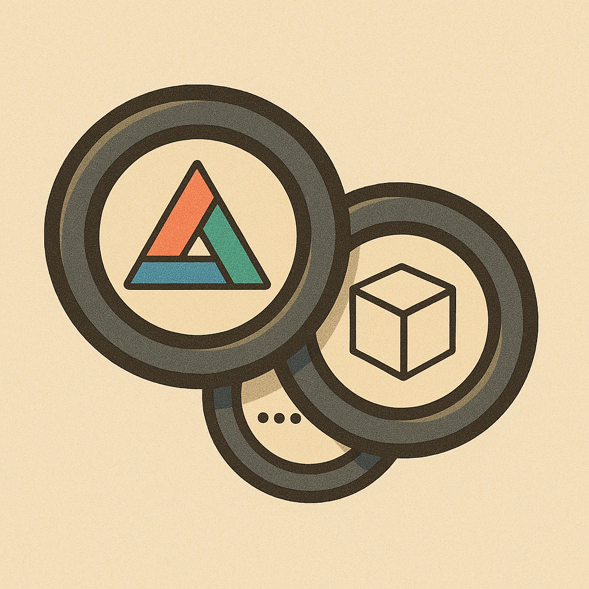

# 3Lens

3Lens is a browser-based inspector and utility toolkit for working with [three.js](https://threejs.org/) scenes. It allows you to interact with the renderer, scene, and canvas to understand exactly what's happening inside your WebGL applications. The goal is to provide an advanced set of tools that support multiple browser types and help you debug or analyze your rendering pipeline.

## Features

- Inspect three.js scenes directly in the browser
- Interact with renderers, scenes, cameras, and more
- Works across multiple browsers
- Built with extensibility in mind for future tools

## Getting Started

The project is in an early stage. Clone the repository and open the demo page in your browser. More detailed setup instructions will be added soon.

## Contributing

Contributions are welcome! Feel free to open issues or submit pull requests if you'd like to help improve 3Lens.

## License

This project is licensed under the MIT License. See the [LICENSE](LICENSE) file for details.
