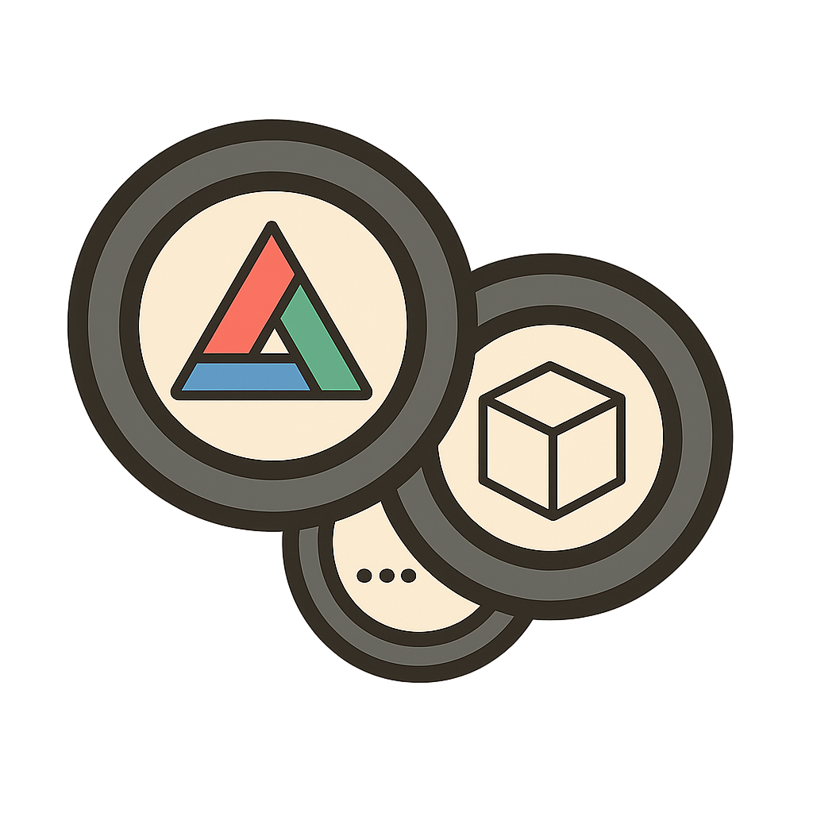

<h1 align="center">3Lens</h1>

<p align="center">
  
</p>

<p align="center">
  <strong>The definitive developer toolkit for three.js</strong>
</p>

<p align="center">
  <a href="LICENSE"></a>
  <a href="https://threejs.org/"></a>
  
</p>

<p align="center">
  Inspect scenes, track performance, and debug WebGL/WebGPU apps without leaving the browser.
</p>

---

## ✨ Features

- **Scene Inspector** — Explore the scene graph with a tree view, select objects, and inspect properties
- **Performance Monitoring** — Real-time stats for FPS, draw calls, triangles, and frame timing
- **Rule Violations** — Set thresholds and get warned when performance degrades
- **Dual Modes** — Use as an in-app overlay or browser extension (Chrome DevTools panel)
- **Zero Config** — Works out of the box with any three.js application

## 📦 Packages

| Package | Description |
|---------|-------------|
| `@3lens/core` | Probe SDK that collects stats and exposes events |
| `@3lens/overlay` | In-app floating panel UI |
| `@3lens/extension` | Chrome DevTools extension |

---

## 🚀 Quick Start

### Installation

```bash
npm install @3lens/core @3lens/overlay
# or
pnpm add @3lens/core @3lens/overlay
# or
yarn add @3lens/core @3lens/overlay
```

> **Note:** 3Lens is currently in alpha. The packages are not yet published to npm. See [Development Setup](#development-setup) to try it locally.

### Basic Usage

```typescript
import * as THREE from 'three';
import { createProbe } from '@3lens/core';
import { createOverlay } from '@3lens/overlay';

// Your three.js setup
const renderer = new THREE.WebGLRenderer();
const scene = new THREE.Scene();
const camera = new THREE.PerspectiveCamera(75, window.innerWidth / window.innerHeight, 0.1, 1000);

// Create the probe and start observing
const probe = createProbe({
  appName: 'My three.js App',
  rules: {
    maxDrawCalls: 1000,
    maxTriangles: 500_000,
    maxFrameTimeMs: 16.67,
  },
});

probe.observeRenderer(renderer);
probe.observeScene(scene);

// Mount the overlay UI
const overlay = createOverlay(probe);

// Optional: toggle with keyboard shortcut
window.addEventListener('keydown', (e) => {
  if (e.key === 'd' && e.ctrlKey && e.shiftKey) {
    overlay.toggle();
  }
});
```

### One-Line Bootstrap

For quick setup, use the `bootstrapOverlay` helper:

```typescript
import * as THREE from 'three';
import { bootstrapOverlay } from '@3lens/overlay';

const renderer = new THREE.WebGLRenderer();
const scene = new THREE.Scene();

// One call does it all
const { probe, overlay } = bootstrapOverlay({
  renderer,
  scene,
  appName: 'My App',
});
```

---

## 🛠️ Development Setup

### Prerequisites

- Node.js 18+
- pnpm 8+

### Clone and Install

```bash
git clone https://github.com/3lens/3lens.git
cd 3lens
pnpm install
```

### Build All Packages

```bash
pnpm build
```

### Run the Example App

```bash
pnpm --filter @3lens/example-basic dev
```

Open `http://localhost:5173` to see the example scene with the overlay panel.

### Development Mode

Run all packages in watch mode:

```bash
pnpm dev
```

---

## 🔧 Configuration

### Probe Options

```typescript
interface ProbeConfig {
  appName: string;              // Application name for identification
  env?: string;                 // Environment: 'development' | 'staging' | 'production'
  debug?: boolean;              // Enable verbose logging
  rules?: RulesConfig;          // Performance thresholds
  sampling?: SamplingConfig;    // How often to collect stats
}

interface RulesConfig {
  maxDrawCalls?: number;        // Warn when draw calls exceed this
  maxTriangles?: number;        // Warn when triangles exceed this
  maxFrameTimeMs?: number;      // Warn when frame time exceeds this (ms)
  maxTextures?: number;         // Warn when texture count exceeds this
}
```

### Overlay Options

```typescript
interface OverlayOptions {
  probe: DevtoolProbe;          // The probe instance
  position?: 'left' | 'right';  // Panel position (default: 'right')
  collapsed?: boolean;          // Start collapsed (default: false)
}
```

---

## 📖 API Reference

See the full [API Documentation](./docs/API.md) for detailed usage.

### Core API

```typescript
import { createProbe, DevtoolProbe } from '@3lens/core';

const probe = createProbe({ appName: 'My App' });

// Observe renderer and scene
probe.observeRenderer(renderer);
probe.observeScene(scene);

// Get current stats
const stats = probe.getLatestFrameStats();

// Subscribe to frame updates
const unsubscribe = probe.onFrameStats((stats) => {
  console.log(`Frame ${stats.frame}: ${stats.triangles} triangles`);
});

// Take a scene snapshot
const snapshot = probe.takeSnapshot();

// Clean up
probe.dispose();
```

### Overlay API

```typescript
import { createOverlay, ThreeLensOverlay } from '@3lens/overlay';

const overlay = createOverlay(probe);

overlay.show();      // Show the panel
overlay.hide();      // Hide the panel
overlay.toggle();    // Toggle visibility
overlay.destroy();   // Remove from DOM
```

---

## 🎮 Keyboard Shortcuts

| Shortcut | Action |
|----------|--------|
| `Ctrl+Shift+D` | Toggle overlay panel |

---

## 📁 Project Structure

```
3lens/
├── packages/
│   ├── core/           # Probe SDK
│   ├── overlay/        # In-app overlay UI
│   └── extension/      # Browser extension
├── examples/
│   └── basic/          # Vanilla three.js example
└── docs/               # Documentation
```

---

## 🤝 Contributing

Contributions are welcome! Please see [CONTRIBUTING.md](./docs/CONTRIBUTING.md) for guidelines.

```bash
# Run tests
pnpm test

# Type check
pnpm typecheck

# Lint
pnpm lint

# Format code
pnpm format
```

---

## 📄 License

MIT © [3Lens Contributors](./LICENSE)

---

<p align="center">
  <sub>Built with ❤️ for the three.js community</sub>
</p>
