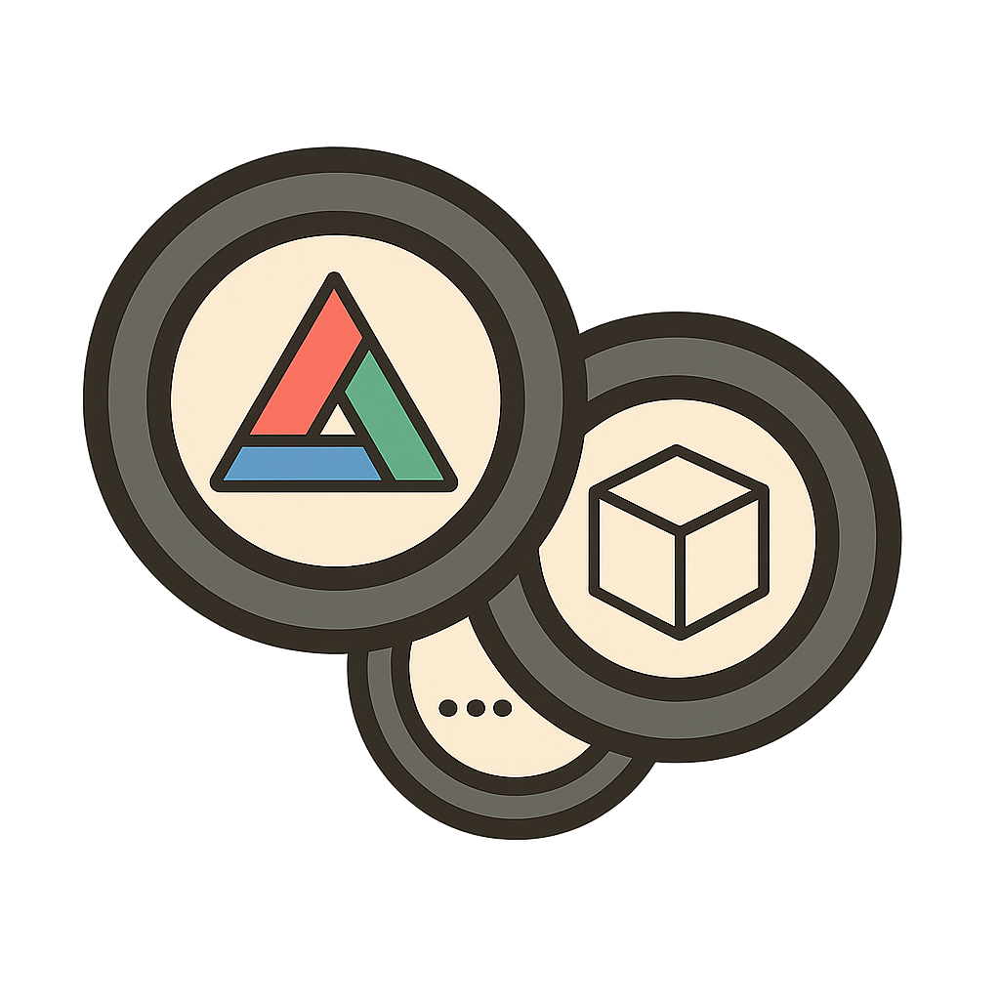

<h1 align="center">3Lens</h1>

<p align="center">
  
</p>

<p align="center">
  <strong>The render introspection OS for three.js</strong>
</p>

<p align="center">
  <a href="LICENSE"></a>
  <a href="https://threejs.org/"></a>
  
  <a href="https://github.com/adriandarian/3Lens/actions/workflows/ci.yml"></a>
</p>

<p align="center">
  Deep causal analysis, trace-based debugging, and actionable optimization for WebGL/WebGPU apps.
</p>

---

> **🚧 Major Redesign In Progress**
>
> 3Lens is undergoing a complete architectural redesign. The new system is built on 5 foundational primitives: **Capture**, **Model**, **Query**, **Visualize**, and **Act + Verify**. See the [Architecture](#-architecture) section for details.

---

## ✨ Vision

3Lens is not just another metrics panel. It's a **render introspection OS** where every tool is a view over shared primitives:

- **Deep Trace + Causal Analysis** — Understand *why* something is slow, not just *that* it's slow
- **Offline Diff/Regression** — Compare traces across sessions, catch regressions in CI
- **Resource Leak Detection** — Full lifecycle tracking, not just counts
- **Actionable Optimization Paths** — Click a metric → see the blame chain → fix the culprit
- **Multi-Context Support** — First-class support for multiple renderers, scenes, cameras

## 📦 Package Architecture

### Core Packages

| Package | Description |
|---------|-------------|
| `@3lens/kernel` | Event capture, entity graph, query engine, trace format |
| `@3lens/runtime` | Public API: `createLens()`, context registration, discovery |
| `@3lens/devtools` | Batteries-included meta-package for most users |

### Host Packages

| Package | Description |
|---------|-------------|
| `@3lens/host-manual` | Vanilla three.js (user provides renderer/scene/camera) |
| `@3lens/host-r3f` | React Three Fiber integration |
| `@3lens/host-tres` | TresJS/Vue integration |
| `@3lens/host-worker` | OffscreenCanvas/Worker support |

### Addon Packages

| Package | Description |
|---------|-------------|
| `@3lens/addon-inspector` | Entity graph browser + blame navigator |
| `@3lens/addon-perf` | Performance analysis with attribution |
| `@3lens/addon-memory` | Resource lifecycle + leak detection |
| `@3lens/addon-diff` | Frame/session/trace comparison |
| `@3lens/addon-shader` | Shader introspection |

### UI Packages

| Package | Description |
|---------|-------------|
| `@3lens/ui-core` | Framework-agnostic UI shell |
| `@3lens/ui-web` | Web Components for universal mounting |

### Mount Kits

| Package | Description |
|---------|-------------|
| `@3lens/mount-angular` | Angular service/component wrapper |
| `@3lens/mount-react` | React context/hooks wrapper |
| `@3lens/mount-vue` | Vue plugin/composables |
| `@3lens/mount-svelte` | Svelte action/component |

### Tooling

| Package | Description |
|---------|-------------|
| `@3lens/vite-plugin` | Dev server injection |
| `@3lens/cli` | Trace recording, diff, validation commands |

---

## 🚀 Quick Start (Preview)

> **Note:** Packages are not yet published. This shows the target API.

```typescript
import { createLens, manualHost, uiOverlay } from "@3lens/devtools";

const lens = createLens({
  ui: uiOverlay(),
  addons: ["inspector", "perf", "memory"],
});

lens.registerContext({
  id: "main",
  host: manualHost({ renderer, scene, camera }),
});

lens.attach();
```

### Web Components

```html
<script type="module">
  import '@3lens/ui-web';
  import { createLens, manualHost } from '@3lens/runtime';

  const lens = createLens();
  lens.registerContext({ id: 'main', host: manualHost({ renderer, scene, camera }) });

  const overlay = document.querySelector('three-lens-overlay');
  overlay.lens = lens;
</script>

<three-lens-overlay></three-lens-overlay>
```

---

## 🏗 Architecture

```
┌─────────────────────────────────────────────────────────────┐
│                        Your App                             │
├─────────────────────────────────────────────────────────────┤
│  Mount Kit (optional)     │  Host Integration               │
│  @3lens/mount-react       │  @3lens/host-manual             │
│  @3lens/mount-vue         │  @3lens/host-r3f                │
│  @3lens/mount-angular     │  @3lens/host-tres               │
│  @3lens/mount-svelte      │  @3lens/host-worker             │
├─────────────────────────────────────────────────────────────┤
│                     @3lens/runtime                          │
│            createLens() • registerContext()                 │
├─────────────────────────────────────────────────────────────┤
│  Addons                   │  UI                             │
│  @3lens/addon-inspector   │  @3lens/ui-core                 │
│  @3lens/addon-perf        │  @3lens/ui-web                  │
│  @3lens/addon-memory      │                                 │
│  @3lens/addon-diff        │                                 │
│  @3lens/addon-shader      │                                 │
├─────────────────────────────────────────────────────────────┤
│                      @3lens/kernel                          │
│         Capture • Entity Graph • Query • Trace              │
└─────────────────────────────────────────────────────────────┘
```

### The 5 Foundational Primitives

1. **Capture** — Authoritative event stream (render events, resource lifecycle)
2. **Model** — Unified typed dependency graph (entities + relationships)
3. **Query** — Tools query the model, not the renderer directly
4. **Visualize** — Views are projections of queries
5. **Act + Verify** — Actions produce events, verification shows diffs

---

## 📁 Project Structure

```
packages/
├── core/                 # Core packages
│   ├── kernel/          # Event capture, entity graph, queries, trace
│   ├── runtime/         # Public API, createLens, hosts, addons
│   └── devtools/        # Batteries-included meta-package
├── hosts/               # Runtime integrations
│   ├── manual/          # Vanilla three.js
│   ├── r3f/             # React Three Fiber
│   ├── tres/            # TresJS/Vue
│   └── worker/          # OffscreenCanvas/Worker
├── addons/              # Feature modules
│   ├── inspector/       # Entity browser, blame navigator
│   ├── perf/            # Performance analysis
│   ├── memory/          # Resource lifecycle, leak detection
│   ├── diff/            # Frame/trace comparison
│   └── shader/          # Shader introspection
├── ui/                  # UI packages
│   ├── core/            # Framework-agnostic UI shell
│   └── web/             # Web Components
├── mounts/              # Framework mount kits
│   ├── angular/
│   ├── react/
│   ├── vue/
│   └── svelte/
└── tools/               # Build & CLI tools
    ├── cli/
    └── vite-plugin/
```

---

## 🛠️ Development Setup

### Prerequisites

- Node.js 20+
- pnpm 9+

### Clone and Install

```bash
git clone https://github.com/adriandarian/3Lens.git
cd 3Lens
pnpm install
```

### Build All Packages

```bash
pnpm build
```

### Run Tests

```bash
pnpm test
```

---

## 📋 Project Status

| Component | Status |
|-----------|--------|
| Kernel (capture, graph, query, trace) | ✅ Implemented |
| Runtime (createLens, hosts, addons) | ✅ Implemented |
| Host: Manual | ✅ Implemented |
| Host: R3F, TresJS, Worker | 🔜 Stub |
| Addons: Inspector | ✅ Implemented |
| Addons: Perf, Memory, Diff, Shader | 🔜 Stub |
| UI: Core | ✅ Implemented |
| UI: Web Components | ✅ Implemented |
| Mount Kits | 🔜 Stub |
| CLI | ✅ Implemented |
| Vite Plugin | ✅ Implemented |
| Examples | 🔜 Not Started |
| Documentation | 🔜 In Progress |

---

## 📖 Documentation

- [Architecture Guide](./agents.md) — Project philosophy and design principles
- [Contracts](./agents/contracts/) — System invariants and guarantees
- [Plugin API](./docs/guide/plugin-api.md) — Building third-party addons
- [Skills & Commands](.cursor/commands/) — CLI commands and programmatic APIs

---

## 🤝 Contributing

Contributions are welcome! Please see [CONTRIBUTING.md](./docs/CONTRIBUTING.md) for guidelines.

```bash
# Run tests
pnpm test

# Type check
pnpm typecheck

# Lint
pnpm lint
```

---

## 📄 License

MIT © [3Lens Contributors](./LICENSE)

---

<p align="center">
  <sub>Built with ❤️ for the three.js community</sub>
</p>
